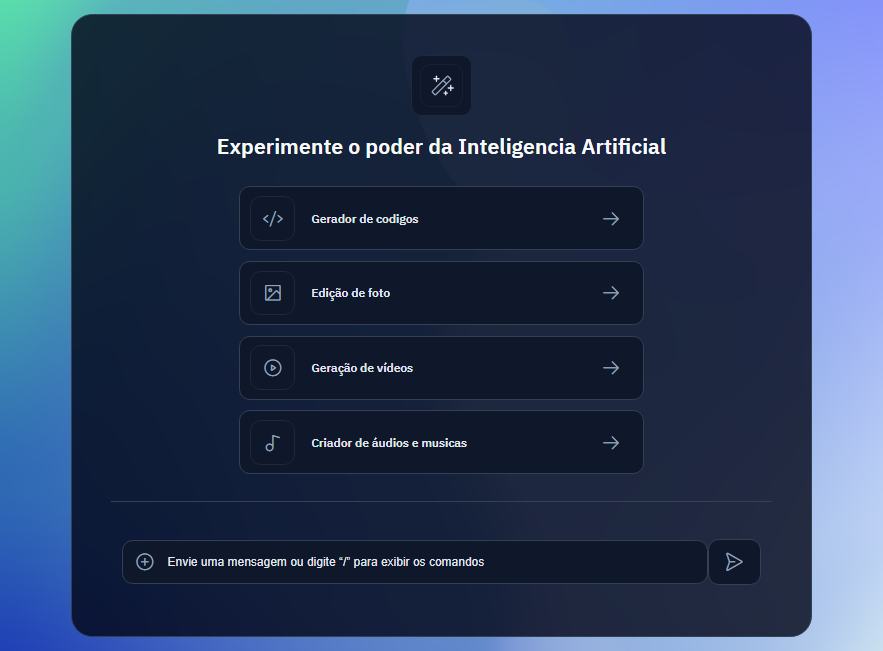

# Plat_IA_BoraCodar28
Develop the start screen of an artificial intelligence platform

<strong><h1 align="center">#boraCodar - Challenge 28</h1></strong>

  

# :red_haired_woman: 💻 Project
📸  Develop the start screen of an artificial intelligence platform. Visit the project online
 📸 Project online 🔗 [LINK](https://platia.netlify.app/)

## 🔖 Layout
You can view the project layout:
 [link]( https://www.figma.com/file/kPuqLjpbXcikW1EzKsHYCi/Plataforma-de-IA---Desafio-28-(Community)?type=design&node-id=0-1&mode=design&t=pNHGlbBjPa4q5w5c-0). 
You need to have an account with [Figma](https://figma.com) to access it.

## 🚀 Technology
It was developed with the following technologies:
- HTML
- CSS
----------------------

### Contact

### [**Luciana Diemert**](https://github.com/ludiemert)

🛠 `Jr. Web Developer | HTML | CSS | JavaScript | ReactJS | NodeJS | Full Stack` Developer Jr.  
📍 São Jose dos Campos – SP - Brazil

&nbsp;
&nbsp;
&nbsp;
&nbsp;

------------------
## 🎁 Acknowledgements and dedications
* Thank you #Rocketseat team
